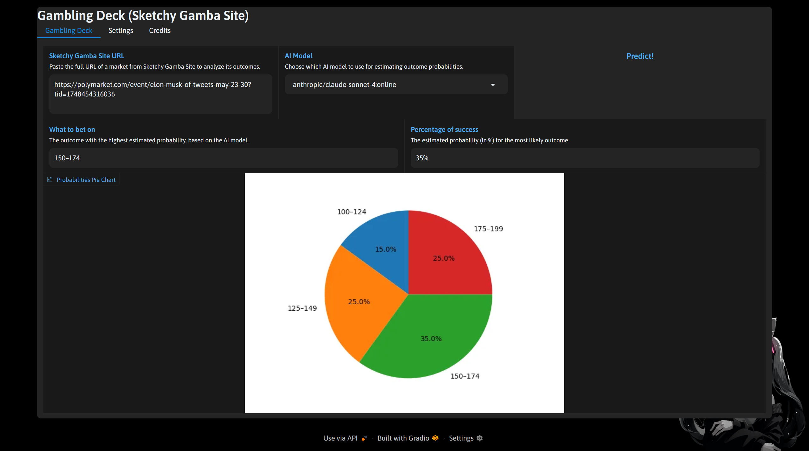

# Gamba Deck

Gamba Deck is a Gradio webapp that scrapes market questions and outcomes from a "Sketchy Gamba Site" and uses an LLM (via OpenRouter) to estimate outcome probabilities. It visualizes results, supports multiple models, and features a simple API key management system. Built for demonstration and educational purposes.

---

# Setup

Clone the repo and install dependencies:

```
git clone https://github.com/Koischizo/gamba-deck.git
cd gamba-deck
pip install -r requirements.txt
```

You also need [ffmpeg](https://ffmpeg.org/) installed for sound playback (required by `playsound`).

You must have [Chrome](https://www.google.com/chrome/) and [ChromeDriver](https://chromedriver.chromium.org/downloads) installed and available in your PATH, or place `chromedriver.exe` in the project directory.

---

# Usage

1. Run the app:

```
python app.py
```

2. Open the Gradio web UI in your browser (the link will be printed in the terminal).

3. Accept the warning to proceed.

4. Paste a market URL from the Sketchy Gamba Site and click **Predict!**

5. View the AI's probability estimates and pie chart.

6. Manage your OpenRouter API key in the **Settings** tab.

7. Check out the **Credits** tab for developer info and patrons.

---

# API Key

You need an [OpenRouter API key](https://openrouter.ai/) to use the AI models. Enter it in the **Settings** tab. The key is encrypted and stored locally in the project directory (not uploaded anywhere).

---

# Notes

- All user-facing references to gambling are obfuscated for public/YouTube safety.
- If you run into issues with Selenium/ChromeDriver, make sure your Chrome and ChromeDriver versions match.
- All settings and keys are stored locally and ignored by git.

---

# Need More Help?

ask chatgpt

---

# Live Demo

See it in action on YouTube:

[Demo Video](https://www.youtube.com/@SchizoDev/)

---

# Screenshot



---

# License

This program is under the [MIT license](/LICENSE)